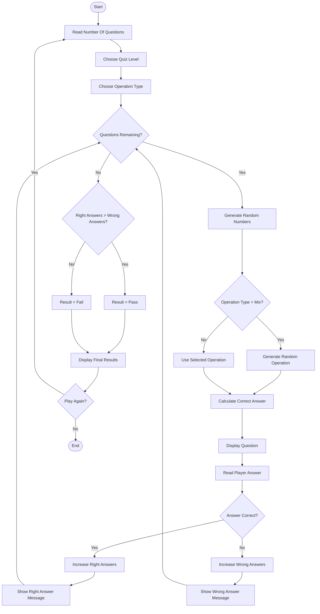

# 🎮 Math Quiz Game - Flowchart

# 🎮 Math Quiz Game in C++

A fun console-based math quiz game built using C++ 🧠✨
This project was created while learning problem-solving and programming fundamentals, with the goal of practicing functions, enums, structs, and clean coding in an enjoyable way 🚀

## ✨ Features

* 🎲 Randomly generated math questions
* 📚 Multiple difficulty levels:

  * Easy
  * Medium
  * Hard
  * Mixed
* ➕➖✖️➗ Different operation types
* ✅ Tracks correct answers
* ❌ Counts wrong answers
* 🏆 Final result screen (Pass / Fail)
* 🎨 Colored feedback screen for better experience
* 🔁 Play again feature

## 🛠️ Concepts Practiced

* Functions
* Enums
* Structs
* Random number generation
* Loops & conditions
* Modular programming
* User interaction in console apps

## 💻 Technologies

* C++
* Console Application

## 🚀 How to Run

1. Compile the project using any C++ compiler.
2. Run the program.
3. Choose:

   * Number of questions
   * Difficulty level
   * Operation type
4. Start solving and have fun 😄

## 📖 Purpose of the Project

This project is part of my learning journey in C++ and problem-solving 💡
I built it to improve my programming logic and practice writing organized code while creating something interactive and enjoyable 🎯
